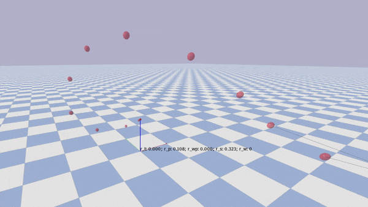

# Reinforcement Learning for Quadcopter Control

This repository is a fork of [gym-pybullet-drones](https://github.com/utiasDSL/gym-pybullet-drones) and implements a reinforcement learning based control policy inspired by [Penicka et al. [1]](https://rpg.ifi.uzh.ch/docs/RAL_IROS22_Penicka.pdf). 

## Result



- The drone can follow arbitrary trajectories. 
- It is given two next target waypoints as observation. If the two target waypoints are close, it will reach the target slower. 
- The learned policy corresponds to the obtained result after _slow-phase training_ in [Penicka et al. [1]](https://rpg.ifi.uzh.ch/docs/RAL_IROS22_Penicka.pdf).

## Implemented New Features

- Reward implementation of RL policy proposed by [Penicka et al. [1]](https://rpg.ifi.uzh.ch/docs/RAL_IROS22_Penicka.pdf).
- Attitude control action type. In [gym-pybullet-drones](https://github.com/utiasDSL/gym-pybullet-drones), only motor-level control using PWM signals is implemented. This repository extends the original implementation and adds a wrapper for sending attitude commands (thrust and bodyrates).
- Random trajectory generation using polynomial minimum snap trajectory generation using [large_scale_traj_optimizer [2]](https://github.com/ZJU-FAST-Lab/large_scale_traj_optimizer) for training and test set generation. Implementation in [trajectories](./trajectories/) subfolder.
- Scripts for bechmarking the policy by computing basic benchmarks such as mean and max deviation from the target trajectory and time until completion.

## Setup

Tested on ArchLinux and Ubuntu. Note that Eigen must be installed on the system. On linux, install via your package manager. E.g. on Ubuntu:

```s
$ sudo apt-get install libeigen3-dev
```

It is strongly recommended to use a python virtual environment such as _conda_ or _pyvenv_.

1. Initialise repository. Repository must be pulled recursively

```s
$ git clone git@github.com:danielbinschmid/RL-pybullets-cf.git
$ git submodule --init --recursive
```

2. Initialise virtual environment. Tested with python version 3.10.13. E.g.:

```s
$ pyenv install 3.10.13
$ pyenv local 3.10.13
$ python3 -m venv ./venv
$ source ./venv/bin/activate
$ pip3 install --upgrade pip
```

3. Install dependencies and build

```s
$ pip3 install -e . # if needed, `sudo apt install build-essential` to install `gcc` and build `pybullet`
```

## Usage

Scripts for training, testing and visualization are provided. 

### Training

## Implementation Overview

## Dev


### Testing

Run all tests from the top folder with

```sh
pytest tests/
```

## Common Issues

- *Existing and mismatching CMakeCache.txt in [trajectories/trajectories_generation](./trajectories/trajectories_generation).* Solution: Remove CMakeCache.txt in build folder of [trajectories/trajectories_generation](./trajectories/trajectories_generation).

## References 

- [1]: Penicka, Robert, et al. [*Learning minimum-time flight in cluttered environments.*](https://rpg.ifi.uzh.ch/docs/RAL_IROS22_Penicka.pdf) IEEE Robotics and Automation Letters 7.3 (2022): 7209-7216.
- [2]: Burke, Declan, Airlie Chapman, and Iman Shames. [*Generating minimum-snap quadrotor trajectories really fast.*](https://ieeexplore.ieee.org/abstract/document/9341794) 2020 IEEE/RSJ International Conference on Intelligent Robots and Systems (IROS). IEEE, 2020. [github](https://github.com/ZJU-FAST-Lab/large_scale_traj_optimizer)